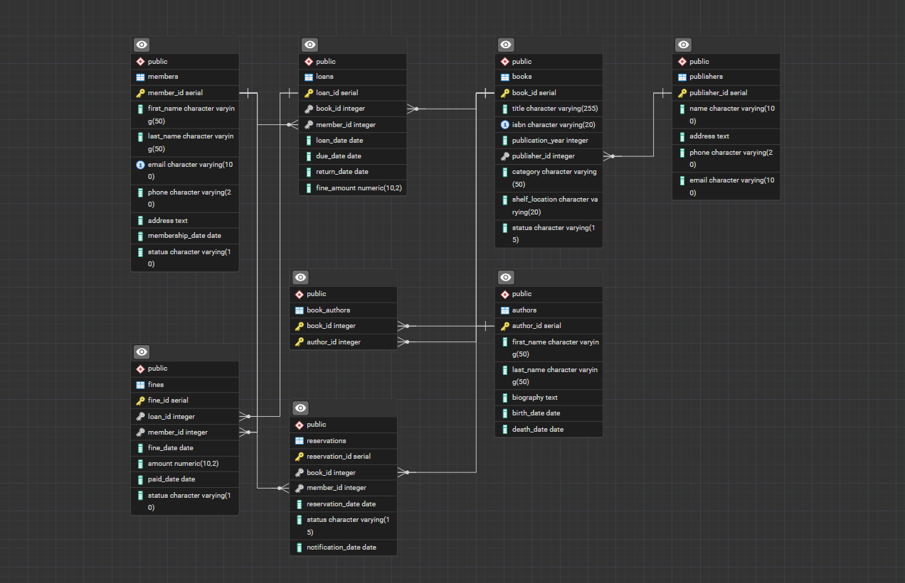

# 📚 Library Management System - PostgreSQL


A comprehensive Library Management System built with PostgreSQL, featuring advanced database design, stored procedures, triggers, and optimized queries.

## ✨ Features

- **Advanced Database Design**: Normalized schema with proper relationships
- **Business Logic**: Stored procedures and triggers for core operations
- **Performance Optimized**: Strategic indexing and query optimization
- **Comprehensive Reporting**: Views for management insights
- **Scalable Architecture**: Designed for growth and maintenance

## 🏗️ Database Schema




### Table Specifications

#### Members Table
- **Purpose**: Store library member information
- **Key Fields**: member_id, email (unique), status
- **Constraints**: Email uniqueness, status validation

#### Books Table  
- **Purpose**: Core book inventory management
- **Key Fields**: book_id, isbn (unique), status
- **Constraints**: ISBN uniqueness, status validation

#### Normalization Level
- **3rd Normal Form (3NF)**: Achieved through:
  - No transitive dependencies
  - No partial dependencies
  - All non-key attributes dependent only on primary key

## 🔍 Design Decisions

### 1. Many-to-Many Relationships
**Challenge**: Books can have multiple authors, authors can have multiple books
**Solution**: Created `book_authors` junction table with composite primary key

### 2. Status Management
**Challenge**: Books can have multiple states (Available, Borrowed, Reserved, Maintenance)
**Solution**: Implemented CHECK constraints and trigger-based status updates

### 3. Fine Calculation
**Challenge**: Dynamic fine calculation based on overdue days
**Solution**: Implemented stored procedure with real-time calculation

### 4. Search Optimization
**Challenge**: Efficient searching across multiple tables
**Solution**: Created dedicated search function with proper indexing

## 📊 Performance Considerations

### Indexing Strategy
```sql
-- Frequently queried columns
CREATE INDEX idx_books_title ON books(title);
CREATE INDEX idx_books_isbn ON books(isbn);
CREATE INDEX idx_members_email ON members(email);

-- Foreign key indexes for join performance
CREATE INDEX idx_loans_member ON loans(member_id);
CREATE INDEX idx_loans_book ON loans(book_id);
CREATE INDEX idx_books_publisher ON books(publisher_id);

## 🚀 Quick Start

### Prerequisites
- PostgreSQL 13+
- pgAdmin 4 or psql client

### Installation

```bash
# Clone the repository
git clone https://github.com/yourusername/library-management-system.git
cd library-management-system

