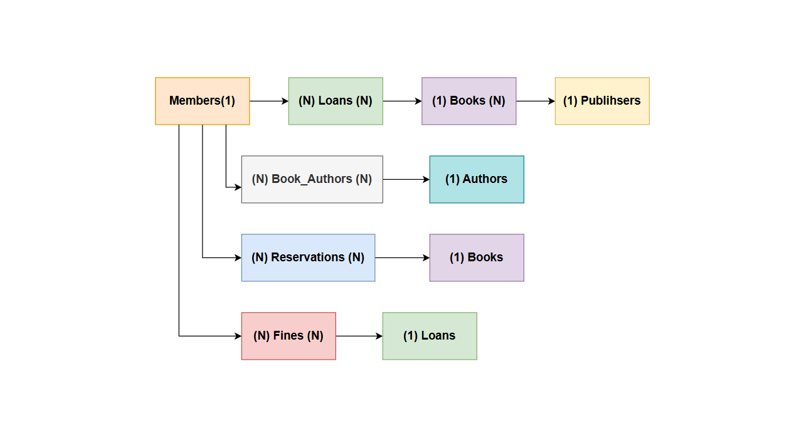

# 📚 Library Management System - PostgreSQL


A comprehensive Library Management System built with PostgreSQL, featuring advanced database design, stored procedures, triggers, and optimized queries.

## ✨ Features

- **Advanced Database Design**: Normalized schema with proper relationships
- **Business Logic**: Stored procedures and triggers for core operations
- **Performance Optimized**: Strategic indexing and query optimization
- **Comprehensive Reporting**: Views for management insights
- **Scalable Architecture**: Designed for growth and maintenance

## 🏗️ Database Schema



## 🚀 Quick Start

### Prerequisites
- PostgreSQL 13+
- pgAdmin 4 or psql client

### Installation

```bash
# Clone the repository
git clone https://github.com/yourusername/library-management-system.git
cd library-management-system

